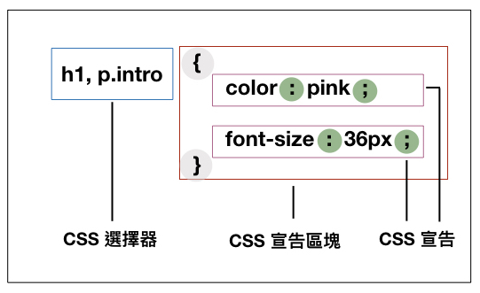

# 新聞網頁製作(二)- CSS 串接樣式表

## 學習目標
* 基礎了解／運用 CSS (Cascading Style Sheets)
  * 在 HTML 中使用 CSS
    * inline style
    * `<style>` 標籤
    * `<link>` 標籤
  * CSS 語法
  * 文字樣式
  * 背景(`background`)、內距(`padding`)、邊界(`border`)和外距(`margin`)
  * 練習：
    * 實作**文章段落**
    * 實作**抽言**

## CSS (Cascading Style Sheets)
- [CSS 基礎](https://developer.mozilla.org/zh-TW/docs/Web/CSS)
- [CSS tutorial](https://www.w3schools.com/css/default.asp)

## CSS 語法


注意：
1. 以上標點符號 `{ } : ;` 皆是半形符號。
2. 一個 CSS 宣告區塊裡，可以寫多個 CSS 宣告。
3. CSS 選擇器會在後面的章節提及。


## 在 HTML 中使用 CSS
當我們 html 寫完後，網頁只會有基本的樣式表。<br>
此時，網頁需要 CSS 的幫助，才會成為ㄧ個具有風格的網頁。<br>
接下來，我們會藉由 CSS 為網頁添加字型、顏色、邊框、底色等等風格。<br>

在 HTML 中要使用 CSS ，有三種方式，<br>
分別是

1. inline style
2. `<style>` 標籤
3. `<link>` 標籤

以下會分別介紹他們的使用方式。

### inline style

所謂的 inline style，即是在起始標籤上加上 `style` 屬性。<br>
在[上一堂課](https://nickhsine.github.io/teach-at-nccu/2020/04-09)中的範例，都是使用 inline style 的方式撰寫。<br>
下例是讓 h1 大標，顯示為粉紅色。

```
<!-- 粉紅色字體的大標 -->
<h1 style="color: pink;">粉紅色口罩很好看！不好看是因為戴在你臉上</h1>
```

inline style 讓我們可以添加 CSS 樣式在任何的標籤上，<br>
然而，當我們想要所有的大標都是粉紅色的時候，<br>
我們必須在每個 `<h1>` 上都添上 `style="color: pink;"`。<br>
此舉動不僅費力，也會讓整個 HTML 看起來密密麻麻的，不容易維護。

那有沒有什麼方法，只要我定義一次標題的樣式，<br>
就可以到處套用呢？<br>

有的，我們可以使用` <style>` 標籤，來達成上述需求。

### `<style>` 標籤
大部分的工程師，在撰寫 CSS 時，都會將 CSS 樣式集中寫（定義）在同一個地方，方便管理和除錯。<br>
透過 **CSS 選擇器 (CSS Selector)**（CSS 選擇器會在下堂課上到，先略過不細究）的方式，將樣式作用在符合條件的標籤上。<br>
上面的介紹聽起來有點抽象，我們多看幾個例子，來習慣這種寫法。

```
<html>
<head>
  <style>
    h1 {
      color: pink;
      font-size: 36px;
    }
  </style>
</head>
<body>
  <h1>標題字會套用粉紅色和36px大小</h1>
  <h1>這個標題也會套用粉紅色字體和36px大小</h1>
</body>
</html>
```

上述例子，翻譯成白話文即是<br>
我在 HTML 開頭(`<head></head>`)的地方，定義了 `<h1>` 的 CSS 樣式，<br>
因此，該 HTML 中所有的 `<h1>` 的字，都會套上粉紅色和字級大小36px的樣式。

補充說明：
* 我們習慣將 `<style>` 標籤定義在 `<head>` 中。
* `<head>` 並不會呈現在網頁上面，它的用途是用來定義這網頁的 metadata。

### `<link>` 標籤
透過 `<style>` 標籤，我們可以避免在同一份 HTML 檔案裡，一直寫重複的樣式。<br>
然而，當我們的網站有越來越多的頁面，越來越多的 HTML 檔時，<br>
在不同的 HTML 檔案裡面，我們仍會重複定義相同的 CSS 樣式。<br>
為了避免重複的 CSS 樣式散落在不同 HTML 檔案裡，<br>
我們會將重複的 CSS 樣式獨立成一個 CSS 檔案，<br>
接著在 HTML 裡，用 `<link>` 方式將 CSS 樣式載入。<br>

```
<link rel="stylesheet" type="text/css" href="./article-style.css">
```

上述例子中，瀏覽器會讀取 `./article-style.css` 檔案，<br>
並將定義在該檔案裡的樣式套用在網頁上。

## 文字樣式
CSS 樣式[百百種](https://developer.mozilla.org/en-US/docs/Web/CSS/Reference)，很難把所有的樣式都帶過一遍。<br>
我們這堂課會針對新聞網頁上常用的樣式講解，<br>
其中又以「文字樣式」最常被使用。<br>

|樣式名稱 | 說明 | 範例 |
|---------|------|------|
|`font-family`|字體設定，瀏覽器會從左至右選擇字型。<br>若瀏覽器找不到字型，則會往下一個找。|`font-family: Microsoft JhengHei, Noto Sans TC, PingFang TC, Apple LiGothic Medium, Roboto, Lucida Grande, Lucida Sans Unicode, sans-serif;`|
|`font-size`|字級大小設定| `font-size: 16px` |
|`font-weight`|字體粗細。可以用`100`, `200`, ..., `900`來指定，數值越大，字體越粗，也可以用`light`, `bold`, `heavy` 等值| `font-weight: 100`<br> `font-weight: 200`<br> `font-weight: bold`<br> |
|`color`|字的顏色，可以輸入文字，<br>如`white`。<br>或是輸入顏色內碼，<br>如`#ffffff`。<br>或是輸入rgba，<br>如`rgba(0, 0, 0, 1)`|`color: white`<br> `color: #ffffff`<br> `color: rgba(0,0,0,1)` |
|`line-height`|每行字的高度| `line-height: normal`<br> `line-height: 1.5` <br> |
|`letter-spacing`|字與字的間距| `letter-spacing: 1px` |
|`text-align`|文字水平對齊<br>`text-align: left｜right｜center｜justify`|`text-align: justify` 展開對齊<br>`text-align:center` 置中對齊<br>|
|`vertical-align`|文字垂直對齊<br>`vertical-align:baseline｜top｜bottom｜middle｜sub｜super｜text-top｜text-bottom`|`vertical-align: middle`|
|`text-decoration`|裝飾文字的方法| `text-decoration: none`<br> `text-decoration: underline`<br>|
|`text-decoration-color`|裝飾文字的顏色| `text-decoration-color: white`|


## 背景(`background`)、內距(`padding`)、邊界(`border`)和外距(`margin`)
針對大部分的 HTML 元素，<br>
我們都可以設定它的高`heigth`、寬`width`、**背景**`background`、**內距**`padding`、**邊界**`border`和**外距**`margin`。<br>
注意：`display: inline` 的元素不能設定高和寬。<br>

舉例來說，若我想要標題的文字是黑色，背景色是粉紅色；我可以寫成
```
<h1 style="color: black; background-color: pink;">文字是黑色，背景色是粉紅色的標題</h1>
```

若我想要在一個高`600px`寬`600px`的區塊的背景放上一張照片，那我可以寫成
```
<div style="height: 600px; width: 600px; background-image: url(https://nickhsine.github.io/teach-at-nccu/2020/04-16-assets/twreporter-telegram.jpg)">報導者 Telegram 上線囉</div>
```

### 背景相關的樣式

|樣式名稱|說明|範例|
|--------|----|----|
|`background-color`|背景顏色|`backgroud-color: pink`|
|`background-image`|背景圖片。值為 `url(你的圖片的網址)` | `background-image: url(https://nickhsine.github.io/teach-at-nccu/2020/04-16-assets/twreporter-telegram.jpg)` |
|`background-repeat`|當背景圖片不足以稱滿元素時，是否重複出現。 `background-repeat: repeat｜repeat-x｜repeat-y｜no-repeat` |`background-repeat: repeat` |
|`background-attachment`|設定圖片是否固定在元素中。<br>`background-attachment: scroll｜fixed｜local`|`background-attachment: scroll` |
|`background-size`|背景尺寸。<br>`background-size: auto｜cover｜contain｜percentage｜length` | `background-size: contain`圖片完整呈現在元素中<br>`background-size: cover`圖片覆蓋整個元素<br>`background-size: 150px 200px`圖片以150px的寬和200px的高呈現 |
|`background-position`|背景圖的位置。<br>由於此設定有點複雜，建議參考[w3schools的說明網頁](https://www.w3schools.com/cssref/pr_background-position.asp)。 | `background-position: center` |

### 內距(`padding`)、邊界(`border`)和外距(`margin`)


#### `padding`: 元素的內距([點此暸解更多](https://www.w3schools.com/cssref/pr_padding.asp))
```
// 上右下左各 10px
padding: 10px; 
padding: 10px 10px 10px 10px;
padding-top: 10px;
padding-right: 10px;
padding-bottom: 10px;
padding-left: 10px;
```

#### `margin` 元素的外距，與其他元素的距離([點此暸解更多](https://www.w3schools.com/cssref/pr_margin.asp))
```
// 上右下左各 10px
margin: 10px; 
margin: 10px 10px 10px 10px;
margin-top: 10px;
margin-right: 10px;
margin-bottom: 10px;
margin-left: 10px;
```

#### `border` 元素的邊框([點此暸解更多](https://www.w3schools.com/cssref/pr_border.asp))
```
// 5公分紅色實線的邊框
border: 5px solid red;
border-width: 5px;
border-style: solid;
border-color: red;

// 畫出圓形的邊框
border-radius: 10px 10px 10px 10px; 
// 第一個 10px 指左上角
// 第二個 10px 指右上角
// 第三個 10px 指右下角
// 第四個 10px 指左下角
```

#### `box-sizing`
`box-sizing: border-box` 的設定是為了方便計算元素的高和寬，<br>
想要知道更多細節，請務必參考[此網頁](http://zh-tw.learnlayout.com/box-sizing.html)

## CSS 註解(Comment)
有時候寫程式碼，你會需要寫一些解釋在程式碼裡，<br/>
但是這些解釋你又不想要呈現在網頁上面。<br/>
針對 CSS 樣式，你可以使用CSS comment。
```
<html>
<head>
<style>
 /* 這是一個註解，不會被瀏覽器視為 CSS 樣式的一部分 */
 div {
  box-sizing: border-box;
 }
</style>
</head>
</html>
```

## 課後練習：
  * 根據[mockup](https://www.figma.com/file/jMxTLYrdMC5dWcTI3iXyng/blockquote)實作**抽言**
  * 根據[mockup](https://www.figma.com/file/yPF3rR6v1UcYHmnjWcEAmc/2020-04-16-%E6%96%87%E7%AB%A0%E9%A0%81?node-id=0%3A1)實作**文章頁**

## 延伸資訊
[基本顏色查詢表](https://www.w3schools.com/cssref/css_colors.asp)

