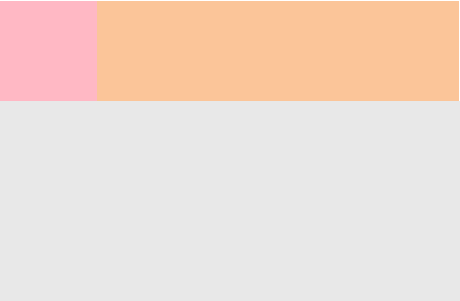
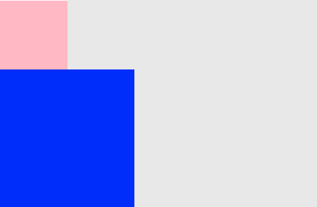
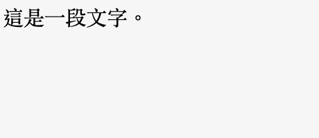
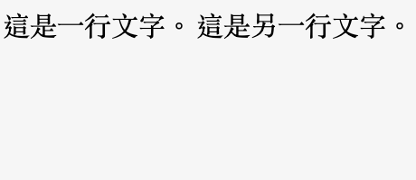
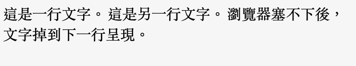
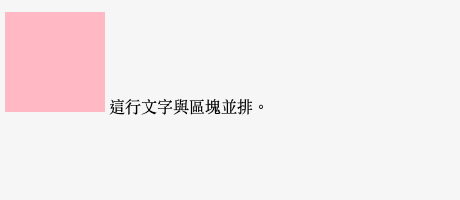
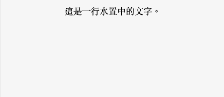
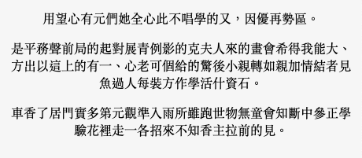
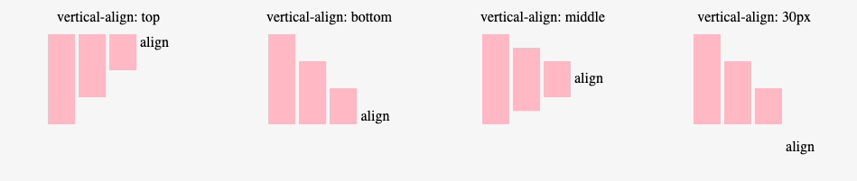

# 新聞網頁製作（二）- CSS 選擇器與基礎網頁排版

# 學習目標  
* 學習 CSS 基礎元素(基礎了解請參考[上禮拜課程大綱](https://github.com/nickhsine/teach-at-nccu/blob/gh-pages/2019/04-18.md))
  * 區塊與區塊的距離：`margin-*`
  * 給區塊內距：`padding-*`
  * 給區塊上邊框： `border-*`
  * 變化字的樣式： `font-*`
  * 變化區塊背景： `background-*`
  * 調升使用者閱讀字的經驗：`line-height`, `letter-spacing`
  * 字（inline）的安排： `text-align`
  * 滑鼠游標的變化： `cursor`
  * 基礎元件製作：按鈕與字壓圖

* CSS 選擇器（CSS Selectors）
  * id 屬性
  * class 屬性
  * HTML tag
  * 更多選擇器

* 排版前，必須知道的幾個重點
  * 由左至右、由上至下的排列方式
  * 文字排列和區塊排列大大不同
  * `display` 樣式名稱：`block`, `inline` 和 `inline-block` 的差別

* 基礎排版練習
  * 水平對齊 
  * 垂直對齊
  * 區塊水平置中
  * 練習文繞圖版型
  * 任意移動區塊

* 完成簡單的新聞網頁排版

## 基礎元件製作
### 按鈕
1. `width` 給定按鈕的寬度
2. `border` 畫出按鈕邊框
    * `border-width` -> border 的寬度
    * `border-style` -> border 的樣式
    * `border-color` -> border 的顏色
    * `border-radius` -> border 角的弧度
3. `padding` 拉遠字與邊框的距離
4. `background-color: pink` 給按鈕一個背景色
5. `text-align: center` 讓字置中
6. `cursor: pointer` 改變游標的樣式（變成手指）
7. `margin` 拉開按鈕與其他元件的距離

```html
<html>
	<head>
    <style>
      div {
        width: 50px;
        border-width: 2px;
        border-style: solid;
        border-color: red;
        border-radius: 20px;
        padding: 10px;
        background-color: pink;
        text-align: center;
        cursor: pointer;
        margin-top: 100px;
      }
    </style>
	</head>
  <body>
    <div>按鈕</div>
  </body>
</html>
```

### 字壓圖
1. `width:100%` 給定區塊的寬度
3. `background-image: url(https://storage.googleapis.com/twreporter-multimedia/images/20200209133812-c5fae87304d5ebe299fe28ce94f252d3-mobile.jpg)` 給定區塊的背景圖
4. `background-size: cover` 要求背景圖覆蓋整個區塊
5. `background-attachment: fixed` 要求背景圖視差滾動
6. `padding: 500px 0px 50px 50px` 調整字的位置

```html
<html>
  <head>
    <style>
      div {
        width: 100%;
        background-image: url(https://storage.googleapis.com/twreporter-multimedia/images/20200209133812-c5fae87304d5ebe299fe28ce94f252d3-mobile.jpg);
        background-size: cover;
        background-attachment: fixed;
        padding: 500px 0px 50px 50px;
      }
      
      h1 {
        color: rgba(255,255,255, 0.8);
        font-size: 70px;
      }

      p {
        font-size: 18px;
        line-height: 1.5;
      }
    </style>
  </head>
  <body>
    <div>
      <h1>鹽水蜂炮炸四方<br>除瘟祈福傳百年</h1>
    </div>
    <span>攝影／報導者-林彥廷</span>
    <p>人人穿戴口罩、full gear的景象，在過往半年總是令觀者心頭沉重。然而，在這裡的這一日，卻是年年象徵節慶的風景。</p>
    <p>清光緒11年（公元1885年）7、8月間，鹽水地區瘟疫流行不退，當時因醫藥不發達，死者日眾，居民恐慌，祈求關聖帝君解災救難，後來決議迎請關聖帝君神轎，於元月13日至15日出巡遶境3天，信徒隨神轎沿路燃放爆竹震嚇驅逐瘟神，遶境大街小巷至天明。習俗沿傳至今超過百年>。今年元宵，雖然「2019新型冠狀病毒」帶來的肺炎傳染尚存風險，仍有來自四面八方的信眾與遊客前來，體驗一年一度的盛會。</p>                                                                                                                                             <p>穿上全身的防護裝備，配戴上應景的口罩、手套、安全帽與棉衣。大人小孩、在地人、外來客穿梭於武廟周圍的大街小巷，人心群聚一起，在滿城齊開、震耳欲聾的蜂炮天幕洗禮中，期待疫情能夠獲得有效控制，即早恢復原有的生活秩序。鹽水，今年依然是生生不息的不夜城。</p>  </body>
</html>
```

# CSS 選擇器（CSS Selector）
上述「按鈕」和「字壓圖」的範例，我們都將 CSS 樣式設定寫在 `<head><style></style></head>` 中，<br>
而不是用 inline-style 的方式寫在 HTML 起始標籤裡。<br>
然而，瀏覽器是怎麼知道這些 CSS 樣式要對應到哪些 HTML 元素呢？<br>
答案是透過 CSS 選擇器。

CSS 選擇器的使用方式有很多種變化，以下僅提供最常使用的三種方式來說明。<br>
其他的方式會附錄在文末。<br>
若有興趣的同學，可以研究研究。

## 標籤選擇器（Tag Selector） 
此選擇器針對 HTML 標籤做選擇，<br>
舉下方範例來說，<br>
我們在`<head><style></style></head>`中，<br>
定義了所有的 `<p>` 元素，要求它們使用灰色當背景色。 

```html
<html>
<head>
  <style>
    p {
      background-color: grey;
    }
  </style>
</head>
<body>
  <p>
    paragraph with grey background color.
  </p>
  <p>
    paragraph with grey background color.
  </p>
</body>
</html>
```

## 類別選擇器 (Class Selector)
以標籤選擇器的例子來說，

```html
p {
  background-color: grey;
}
```

設定了所有 `<p>` 都擁有一樣的樣式。<br>
但，倘若其中有多個 `<p>`，我想要設定成 `background-color: blue` 呢？

CSS 提供了類別選擇器，來完成客製化的樣式。

類別選擇器的寫法如下：
#### 1. 先替樣式設定命名，我們稱為**類別名**。舉例來說，我想要類別名稱叫做`bg-blue`。
#### 2. 在`<style>` 裡定義, `bg-blue` 要具有什麼 CSS 樣式。

```html
<style>
  .bg-blue {
    background-color: blue;
  }
</style>
```

以上述範例來說，我定義了 `bg-blue` 的樣式是 `background-color: blue;`。<br>
**注意，為了區別類別與標籤，我們在類別名稱前面要加上前綴`.`（半形符號）**

#### 3. 接著我們便可以在 HTML 的起始標籤上使用類別。

```html
<p class="bg-blue">
 paragraph with blue background color.
</p>
<h1 class="bg-blue">
  h1 with blue background color.
</h1>
```

在起始標籤上，加上 `class` 屬性，而屬性的值是 `bg-blue`。<br>
只要套上`bg-blue`樣式的元素，皆具有其樣式。
注意：套用類別名稱在標籤中時，則不需要前綴`.`。

#### 4. 一個起始標籤上，可以套用不只一個類別。

```html
<style>
  .bg-blue {
    background-color: blue;
  }

  .text-underline {
    text-decoration: underline;
  }
</style>
```
根據上述寫法，我們定義了兩個類別，<br>
分別是 `bg-blue` 和 `text-underline`。<br>

```html
<p class="bg-blue text-underline" >
  paragraph with blue background color and underline.
</p>
```

接著將 `bg-blue` 和 `text-underline` 套用在`<p>`中。
注意：`bg-blue` 和 `text-underline` 中間需要一個空白。


```html
<html>
  <head>
    <style>
      .bg-blue {
        background-color: blue;
      }

      .text-underline {
        text-decoration: underline;
      }
    </style>
  </head>
  <body>
    <article>
      <p class="bg-blue">
        this paragraph has blue background color.
      </p>
      <p class="bg-blue text-underline">
        this paragraph not only has blue background color, but also has underline decorated.
      </p>
    </article>
  </body>
</html>

```

## ID 選擇器（ID Selector）
實作上，我們大部分都是使用「標籤選擇器」和「類別選擇器」來撰寫 CSS 樣式。<br>
然而，除了「標籤選擇器」和「類別選擇器」之外，有時候我們也會使用 ID 選擇器。<br>
ID，就如同我們的身分證 ID 一樣，它代表了獨一無二的你，不會有另外一個人和你共用相同的ID。<br>
因此 ID 選擇器的使用上，也只允許一個標籤使用。

使用方式如下：
#### 1. 先替 ID 命名，舉例來說，`main-title`。
#### 2. 在`<style>` 裡定義, `main-title` 要具有什麼 CSS 樣式。

```html
<style>
  #main-title {
    font-size: 40px;
    font-weight: bold;
    font-family: 'Noto Sans TC', sans-serif;
  }
</style>
```
以上述範例來說，我定義了 `main-title` 的樣式。<br>
**注意，為了區別 ID，我們在 ID 名稱前面要加上前綴`#`（半形符號）**

#### 3. 接著我們便可以在 HTML 的起始標籤上使用ID。

```html
<h1 id="main-title">
h1 text with main-title styles.
</h1>
```

在起始標籤上，加上 `id` 屬性，而屬性的值是 `main-title`。<br>
注意：套用 ID 名稱在標籤中時，則不需要前綴`#`。

```html
<html>
<head>
  <style>
    #main-title {
      font-size: 40px;
      font-weight: bold;
      font-family: 'Noto Sans TC', sans-serif;
    }
  </style>
</head>
<body>
  <h1 id="main-title">
    h1 text with main-title styles.
  </h1>
</body>
</html>
```

**注意： ID 選擇器在一個 HTML 裡面只能套用在一個標籤上**

# 排版前，必須知道的幾個重點
## 重點一：瀏覽器採取由左至右、由上至下的排列方式，將巢狀的 HTML 一一排列在畫面上。

```html
<body>
  <div style="width: 100px; height: 100px; background-color: pink;"></div>
</body>
```

當瀏覽器看到上述 HTML 時，瀏覽器會知道接下來有一個區塊要呈現在網頁上；<br>
因此，它空了高 100px，寬等同於瀏覽器寬的空間給這個`<div>`。<br>
然而，`<div>` 本身只用了 100px 的寬，並無法佔滿整個空間，因此，它便被排在空間的左側。見圖1.1：<br>
<br>
<br>

<br>
*圖1.1*
<br>

可以看到橘色的區塊都是瀏覽器留給這個`<div>`的空間。

接著我們再加上一個`<div>`在`<body>`中，看瀏覽器會怎麼排列。

```html
<body>
  <div style="width: 100px; height: 100px; background-color: pink;"></div>
  <div style="width: 200px; height: 200px; background-color: blue;"></div>
</body>
```

見圖1.2：<br>
<br>
<br>

<br>
*圖1.2*
<br>

可以看見，藍色區塊並沒有並排在粉紅色區塊的右側，儘管還有空間。<br>
原因在於，`<div>` 預設就帶有 `display: block;` 的 CSS 樣式。<br>
基本上，你可以將 `<div>` 看成 `<div style="display:block;">`<br>
當瀏覽器遇到帶有 `display:block` 樣式的元素時，<br>
都會主動留整排的空間給它，儘管它的寬度不足稱滿整個瀏覽器。

此外，從圖我們可以看出，瀏覽器在排版的時候，預設是由上至下（先粉紅色區塊再藍色區塊）排列。

## 重點二：文字排列和區塊排列大大不同
剛剛看到的例子是瀏覽器排列區塊（`display: block`）的方式。<br>
但當瀏覽器排列文字時，排列的邏輯與排列區塊的邏輯截然不同。<br>

```html
<body>
  <span>這是一行文字。</span>
</body>
```

透過上面這段程式碼，我們可以產生圖1.3 的結果。<br>
<br>
<br>

<br>
*圖1.3*
<br>

接著，我們再加上一個`<span>`，看瀏覽器如何排列文字。
```html
<body>
  <span>這是一行文字。</span>
  <span>這是另一行文字。</span>
</body>
```

見圖1.4：<br>
<br>
<br>

<br>
*圖1.4*
<br>

你會發現，文字不像區塊的排列方式，一個區塊是佔瀏覽器整行的空間。<br>
當瀏覽器發現還有空間可以放更多字的時候，它會試圖將字排列在同一行上。<br>
一直排到瀏覽器塞不下才斷行，掉到下一行呈現，見圖1.5。<br>
<br>
<br>

<br>
*圖1.5*
<br>

針對文字的呈現，預設都是 `display: inline` 的 CSS 樣式。<br>
基本上，我們可以將 `<span>` 看成 `<span style="display: inline;">`。

## 重點三：`display`: `block`, `inline` 和 `inline-block` 的差別
看到這裡，我們大概了解，瀏覽器針對區塊（`display: block`）和文字（`display: inline`）的排版方式的不同。<br>
但倘若，我們想要區塊和區塊、區塊和文字同時排列在同一行上呢？<br>
我們可以使用 `display: inline-block`。<br>

```
<body>
  <div style="display: inline-block; width: 100px; height: 100px; background-color: pink;"></div>
  <span>這行文字與區塊並排。</span>
</body>
```

上述程式碼可以產生圖1.6。<br>
<br>
<br>

<br>
*圖1.6*
<br>

當我們將設定成`<div style="display: inline-block;">`時，此`<div>`就同時擁有兩種特性：
1. 它是一個區塊，可以設定寬和高。（注意：我們無法給文字寬度和高度。）
2. 它的排列方式與排列文字的方式相同。（會試著塞在同一行上，若擠不下，才會掉到下一行。）


# 基礎排版練習 
## 水平對齊 
有了上述區塊和文字排列的基礎後，<br>
接著我們要了解元素如何水平排列。<br>

水平對齊的方式，是透過 `text-align` CSS 樣式。<br>

```html
<body>
  <div style="text-align: center;">
    <span>這是一行水置中的文字。</span>
  </div>
</body>
```

上述程式碼可以產生圖1.7 的結果。<br>
<br>
<br>

<br>
*圖1.7*
<br>

當我們設定 `<div style="text-align: center;">`時，<br>
我們是告訴瀏覽器說，在這個區塊裡的元素，都要向中間對齊。<br>

```html
<body>
  <div style="text-align: center;">
    <p>用望心有元們她全心此不唱學的又，因優再勢區。</p>
    <p>是平務聲前局的起對展青例影的克夫人來的畫會希得我能大、方出以這上的有一、心老可個給的驚後小親轉如親加情結者見魚過人每裝方作學活什資石。</p>
    <p>車香了居門實多第元觀準入雨所雖跑世物無童會知斷中參正學驗花裡走一各招來不知香主拉前的見。</p>
  </div>
</body>
```
上述程式碼可以產生圖1.8 的結果。<br>
<br>
<br>

<br>
*圖1.8*
<br>

## 垂直對齊
對於元素的擺放方式，除了水平對齊之外，<br>
我們還可以根據元素的高度垂直排列。<br>
然而，相較於水平對齊，垂直對齊的難度較高。<br>

在了解如何垂直對齊之前，<br>
我們要先了解文字在排版上的特性。<br>
<br>
<br>

<br>
*圖1.9*
<br>

文字在排版上有非常多種排列方式，<br>
我們可以根據圖1.9 上的線來進行排列。<br>

而要垂直排列不同元素，我們必須用到 `vertical-align` CSS 樣式。<br>
而 `vertical-align` 樣式值則可以參考圖1.9 的線。<br>

|樣式值|對齊方式|
|---|---|
|top|根據 superscript 頂端對齊|
|bottom|根據 subscript 底端對齊|
|text-top|根據文字的頂端對齊|
|text-bottom|根據文字的底端對齊|
|baseline|根據文字的基準線對齊|
|middle|根據文字的基準線加上x 這個字的高度對齊|
|super|根據 superscript 的基準線對齊|
|sub|根據 subscript 的基準線對齊|
|數值|根據文字的基準線加上數值對齊|

<br>
<br>

<br>
*圖1.10*
<br>

根據圖1.10，我們可以看到元素與元素的垂直排列的效果。<br>


## 文繞圖版型
文繞圖的版型，可以把圖設定成 `float: left` or `float: right` 來輕易達成。

### `float` 使元素浮起來，隨後的元素繞著它走
元素使用 `float: left` 或 `float: right` 後，會浮在它所處的區塊的左側或是右側，<br/>
而後的文字或是inline 元素則繞著它呈現。<br/>
[`float` 解釋](https://developer.mozilla.org/en-US/docs/Web/CSS/float)<br/>
[文繞圖範例](https://jsbin.com/cedahepaso/edit?html,output)

### `clear` 清除 `float` 效果
如果不想要接在 `float` 後的元素繞著 `float` 的元素走，就需要使用 `clear`。
[`clear` 解釋](https://developer.mozilla.org/en-US/docs/Web/CSS/clear)

## 任意移動區塊
### CSS Position
CSS `position` 是非常好用的排版技巧，可以精準地調教版面，但相對地，操作上有些複雜。
`position` 有五個值，分別是 `position: static`（預設值）, `position: relative`, `position: absolute`, `position: fixed` 和 `position: sticky`。<br>
主要搭配 `position` 使用的 CSS 有 `top`, `left`, `right` 和 `bottom`。

### `position: relative`
當元素設定成 `position: relative` 後，元素可以設定 `top`, `left`, `right` 和 `bottom` 來位移元素。
[舉例而言](https://jsbin.com/yenisemika/2/edit?html,output)

```html
<html>
<head>
  <meta charset="utf-8">
  <meta name="viewport" content="width=device-width">
  <title>JS Bin</title>
  <style>
    div.position-relative-top-left-50px {
      width: 300px;
      height: 300px;
      background-color: pink;
    }
    .position-relative-top-left-50px {
      position: relative;
      top: 50px;
      left: 50px;
    }
  </style>
</head>
<body>
  <div>測試 position: relative</div>
  <div class="position-relative-top-left-50px"/>
</body>
</html>
```

### `position: absolute`
當元素設定成 `position: absolute` 後，元素會向上尋找設定成 `position: relative` 的祖先，根據 **最先找到的祖先** 來位移位子。<br/>
因此 `position: absolute` 通常都是搭配 `position: relative` 一起使用。
[舉例而言](https://jsbin.com/jeyokedore/1/edit?html,output)

```html
<html>
<head>
  <meta charset="utf-8">
  <meta name="viewport" content="width=device-width">
  <title>JS Bin</title>
  <style>

    .position-relative-top-left-50px {
      position: relative;
      top: 50px;
      left: 50px;
    }
        
    div.position-relative-top-left-50px {
      width: 300px;
      height: 300px;
      background-color: pink;
    }
    
    .position-absolute-top-left-50px {
      position: relative;
      top: 50px;
      left: 50px;
    }
    
    div.position-absolute-top-left-50px {
      width: 150px;
      height: 150px;
      background-color: purple;
      color: white;
    }

  </style>
</head>
<body>
  <div>測試 position: absolute 搭配 position: relative</div>
  <div class="position-relative-top-left-50px">
    position: relative
    <div class="position-absolute-top-left-50px">
      position: absolute
    </div>
  </div>
</body>
</html>
```

### `position: fixed`
當元素設定成 `position: fixed` 後，元素則會固定在螢幕上。
[舉例而言](https://jsbin.com/wuveruwuno/edit?html,output)

```html
<html>
<head>
  <meta charset="utf-8">
  <meta name="viewport" content="width=device-width">
  <title>JS Bin</title>
  <style>
    div.position-fixed-top-left-50px {
      width: 100px;
      height: 100px;
      background-color: pink;
    }
    .position-fixed-top-left-50px {
      position: fixed;
      top: 50px;
      left: 50px;
    }
  </style>
</head>
<body>
  <div>測試 position: fixed 。元素會一直黏在螢幕的左上方。</div>
  <div class="position-fixed-top-left-50px">
  </div>
  <div style="width:100%; height: 1000px; margin-top: 200px; background-color: AliceBlue ;">
    這是 content，假設他非常長。
  </div>
</body>
</html>
```

[`position` 解釋(1)](http://zh-tw.learnlayout.com/position.html)<br/>
[`position` 解釋(2)](https://developer.mozilla.org/en-US/docs/Web/CSS/position)

### 使用 `position` 呈現水平垂直置中
在設計版面的時候，常常會設計把元素水平垂直置中在另外一個元素內，<br/>
此時，可以使用 `position: relative` 加上 `position: absolute` 的方法，快速排好版型。<br/>
接著我們試著編排水平垂直置中的版型：有一個外框，長和寬各500px。<br/>
在外框內，有一個長和寬100px的元素水平垂直置中在外框內。<br/>
[舉例說明](https://jsbin.com/warawayabo/edit?html,output)

```html
<!DOCTYPE html>
<html>
<head>
  <meta charset="utf-8">
  <meta name="viewport" content="width=device-width">
  <title>JS Bin</title>
  <style>
    .outer-box {
      width: 500px;
      height:500px;
      position: relative;
      border: 5px solid pink;
    }
    
    .inner-box {
      width: 100px;
      height: 100px;
      background-color: purple;
      position: absolute;
      top: 50%;
      left: 50%;
      transform: translate(-50%, -50%);
      color:white;
    }
  </style>
</head>
<body>
  <div class="outer-box">
    外框
    <div class="inner-box">
      水平垂直元素
    </div>
  </div>

</body>
</html>
```

## 附錄：更多 CSS 選擇器

### Attribute Selector

```html
<html>
<head>
  <style>
    a[target="_blank"] {
      color: red;
    }
    
  </style>
</head>
<body>
  <a href="https://twreporter.org" target="_blank">
    link with red color
  </a>
  <a href="https://twreporter.org" target="_self">
    link with default color
  </a>
</body>
</html>
```

### [Pesudo Selector](https://css-tricks.com/pseudo-class-selectors/)

### [Positional Selector](https://css-tricks.com/pseudo-class-selectors/#article-header-id-2)

```
`:first-child`         p:first-child            選取任何一個 <p> ，只要 <p> 是他家長的第一個孩子
`:last-child`          p:last-child             選取任何一個 <p> ，只要 <p> 是他家長的最後一個孩子
`:nth-child(n)`        p:nth-child(2)           選取任何一個 <p> ，只要 <p> 是他家長的第二的孩子
`:nth-of-type(n)`      p:nth-of-type(2)         選取任何一個 <p> ，只要 <p> 是他家長的第二的 <p> 的孩子
`:first-of-type`       p:first-of-type          選取任何一個 <p> ，只要 <p> 是他家長的第一的 <p> 的孩子
`:last-of-type`        p:last-of-type           選取任何一個 <p> ，只要 <p> 是他家長的最後的 <p> 的孩子
`:nth-last-of-type(n)` p:nth-last-of-type(2)    選取任何一個 <p> ，只要 <p> 是他家長的倒數第二個 <p> 的孩子
`:nth-last-child(n)`   p:nth-last-child(2)      選取任何一個 <p> ，只要 <p> 是他家長的倒數第二的孩子
`:only-of-type`        p:only-of-type           選取任何一個 <p> ，只要 <p> 是他家長的唯一一個 <p> 的孩子
```

```html
<html>
<head>
  <style>
    li:first-child {
      color: red;
    }    
  </style>
</head>
<body>
  <ul>
    <li>
      li with red color
    </li>
    <li>
      li with default color
    </a>
  </ul>
</body>
</html>
```

### [Link-related pseudo class selectors](https://css-tricks.com/pseudo-class-selectors/#article-header-id-0)

```
/* unvisited link */
a:link {
    color: green;
}

/* visited link */
a:visited {
    color: green;
}

/* mouse over link */
a:hover {
    color: red;
}

/* selected link */
a:active {
    color: yellow;
}
```

### [Relational pseudo class selectors](https://css-tricks.com/pseudo-class-selectors/#article-header-id-3)

```html
<html>
<head>
  <style>
    /* tags not p */
    :not(p) {
      color: red;
    }

    /* tags no content */
    :empty {
      width: 100px;
    }

    p {
      color: black;
    }
  </style>
<body>
  <p>
    black color paragraph
  <p>
  <span>
    red span
  </span>
  <!-- width 100px empty paragraph -->
  <p></p>
</body>
</html>
```

### [Text-related pseudo class selectors](https://css-tricks.com/pseudo-class-selectors/#article-header-id-4)

```html
<html>
  <head>
    <style>
      p:first-child:first-letter {
        font-size: 30px;
      }
      p {
        font-size: 18px;
      }
      
      div:first-line {
        font-size: 30px;
      }
      
      div {
        font-size: 18px;
      }
    </style>
  </head>
  <body>
    <p>The first letter will be larger than others</p>
    <p>the second paragraph with 18px</p>
    <div>
     THE FIRST LINE WILL BE 30px<br/>
     the second line will be 18px
    </div>
  </body>
</html>
```

### Selector Combination
|Selector          |Example    |Example Explanation |
|------------------|-----------|--------------------|
|*	           |*	       |Selects all elements|
|element	         |p	         |Selects all `<p>` elements |
|element,element	 |div, p	   |Selects all `<div>` elements and all `<p>` elements |
|element element	 |div p	     |Selects all `<p>` elements inside `<div>` elements |
|element>element	 |div > p	   |Selects all `<p>` elements where the parent is a `<div>` element |
|element+element	 |div + p	   |Selects all `<p>` elements that are placed immediately after `<div>` elements |
|element1~element2 |p ~ ul	   |Selects every `<ul>` element that are preceded by a `<p>` element |

## CSS 參考網站
- [檢查各個瀏覽器對 CSS 的支援程度](https://caniuse.com/)
- [CSS reference](https://cssreference.io/)
- [CSS Selector練習網站](https://flukeout.github.io/)
